本仓库只针对以下设备：

| 属性 | 信息 |
|------|------|
| **设备名称** | 红米 K30S 至尊纪念版 |
| **发行区域** | 国行 (CN) |
| **英文名称** | Redmi K30S Ultra |
| **代号名称** | apollo |
| **设备型号** | M2007J3SC |
| **处理器** | Qualcomm Snapdragon 865 |
| **芯片型号** | SM8250 |
| **芯片代号** | kona |
| **系统版本** | MIUI 14.0.5.0 稳定版 |
| **安卓版本** | Android 12 (API 31) |
| **内核版本** | 4.19.325 |
| **内核架构** | non-GKI |

**最后更新时间：2025-12-24**

所需环境和模块：
1. SukiSU Ultra v4.1.0
https://github.com/SukiSU-Ultra/SukiSU-Ultra
2. Tricky Store v1.4.1
https://github.com/5ec1cff/TrickyStore
3. Tricky Addon v4.3
https://github.com/KOWX712/Tricky-Addon-Update-Target-List
4. Zygisk Next v1.3.1
https://github.com/Dr-TSNG/ZygiskNext
5. LSPosed IT v1.9.2-it (7455)
https://github.com/LSPosed/LSPosed
6. WebUI X v363
https://github.com/MMRLApp/WebUI-X-Portable
7. HMA-OSS voss-135
https://github.com/frknkrc44/HMA-OSS

环境过检测测试 ✅

0. SukiSU Ultra v4.1.0
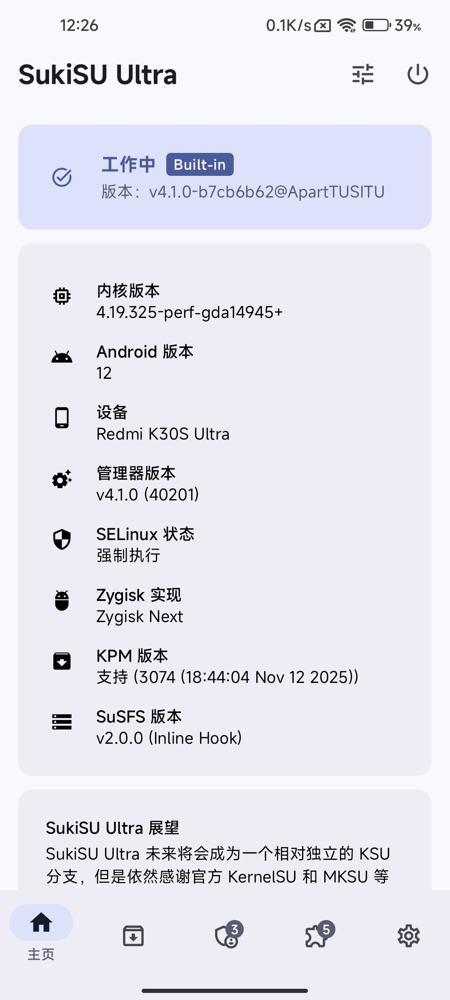

1. Duck Detector v1.6.3
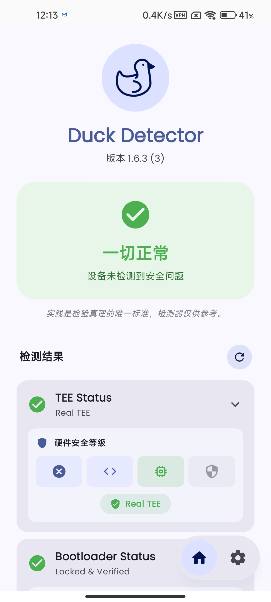

2. 密钥认证 v2.0.3
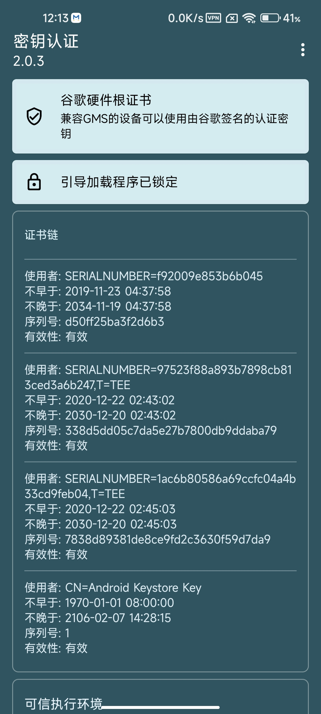

3. Native Test ++

4. Native Detector v7.6.1
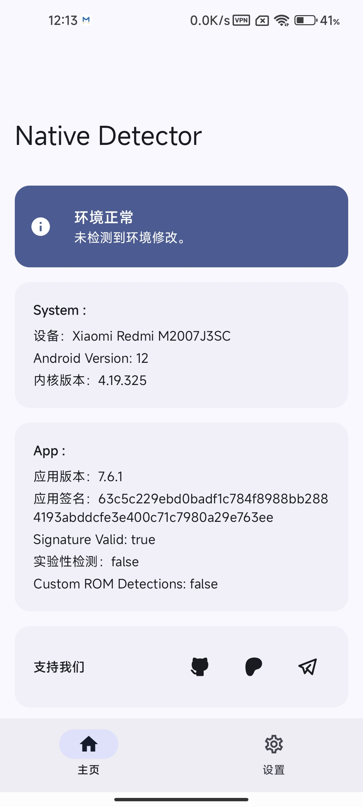

5. CrackME v2.9.5
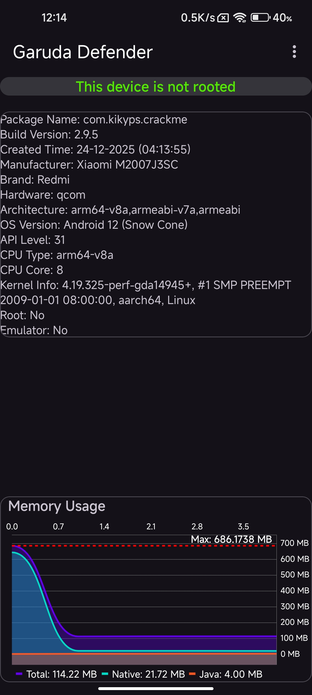

6. Hunter v6.52
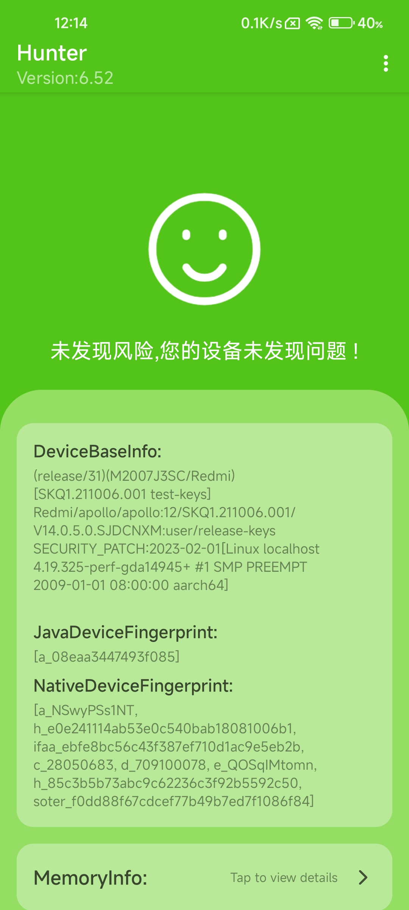

7. Luna v1.4.2.7
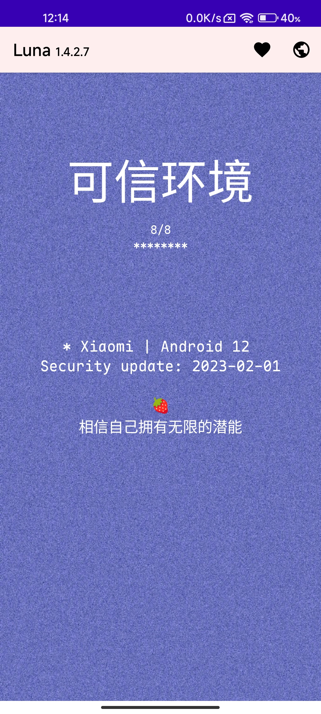

8. Disclosure v1.3
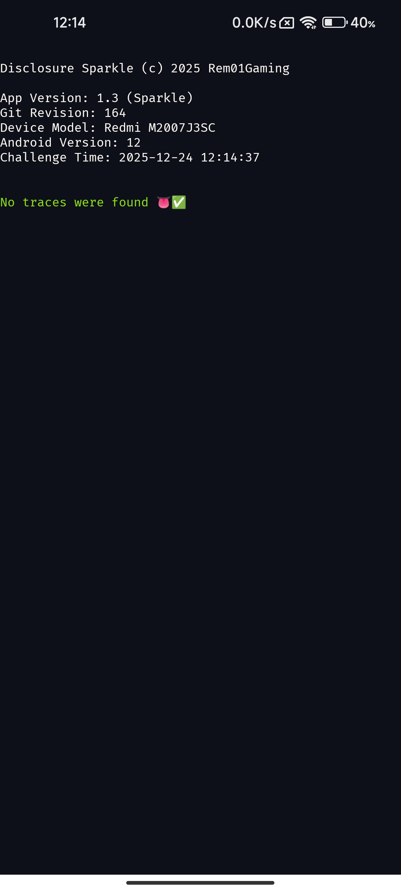

9. Simple Play Integrity Checker v1.4.0
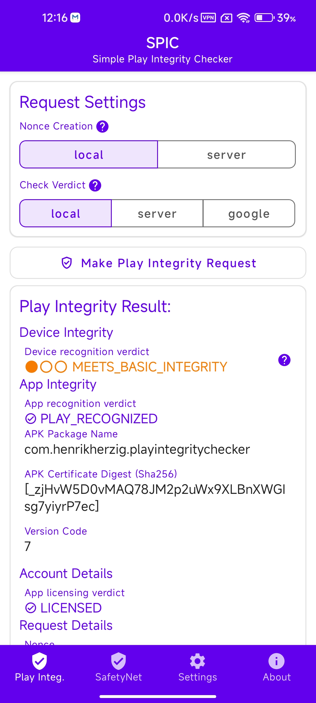

10. Play Integrity API Checker v2.2
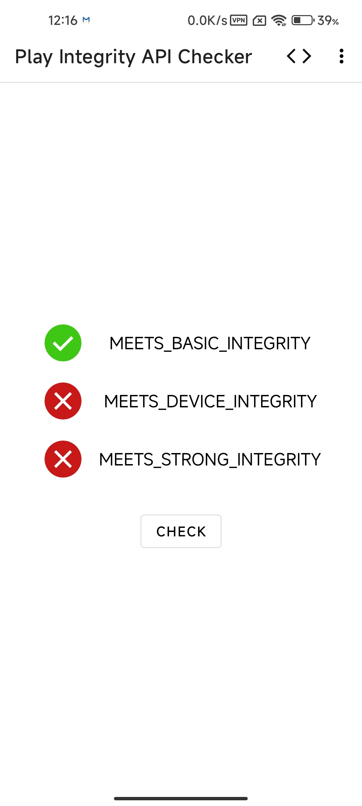

11. Google Play 商店 v48.8.07
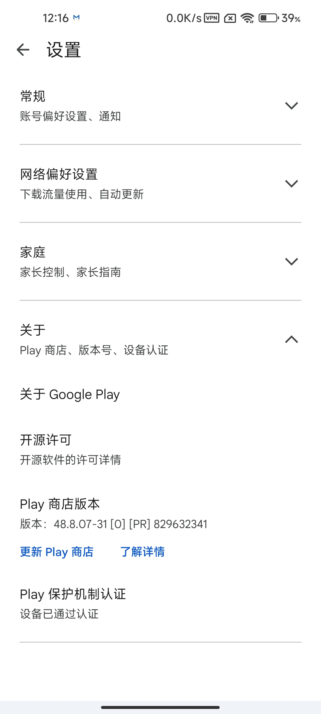